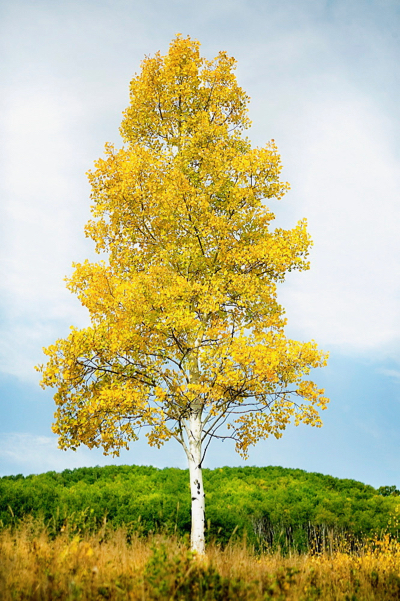
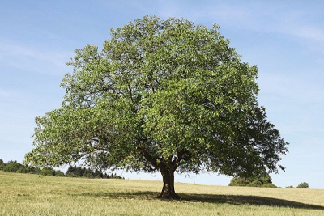
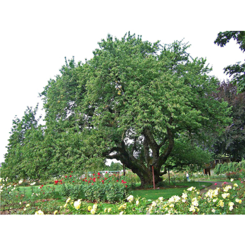

# Tree Species Identification
Rand Richards

When I started in Data Science I really never expected a connection to be made between data science, and my love for woodworking.  As a professional woodworker I follow the teachings and philosophy of Frank Lloyd Wright as far as understanding the material you are working with.  The material I work with is wood, and part of the understanding of that material is understanding and appreciating the tree itself before it becomes lumber.  My wife is always annoyed with the amount of time I spend "taking pictures of interesting trees."  One trip in particular she counted over 100 pictures of different trees.

> 

## Theory for Identification

A characteristic of different species of tress is their proportions &/or shape I will began classifying the trees based solely on the proportion using images taken with a sky background, and allowing the computer to define edges.  I believe this will allow an initial categorization  

> 

## Initial Steps
>- I have reached out to several nurseries with the idea being - they might be interested in such an application fro themselves or for their customer's.  The thought process being that a customer sees a tree they like.  Takes a photo.  The app would identify the tree, and provide information such as care and where to purchase.

> 

## Next:

>- utilize pictures grabbed from web-scraping to began creating the classifier.

## Future Projects
>- Wood Grain Identifier - long grain  
>- Furniture Style Identifier  
>- Colorado Craft Beer Recommender  
>- Arts and Crafts Color Recommender  
